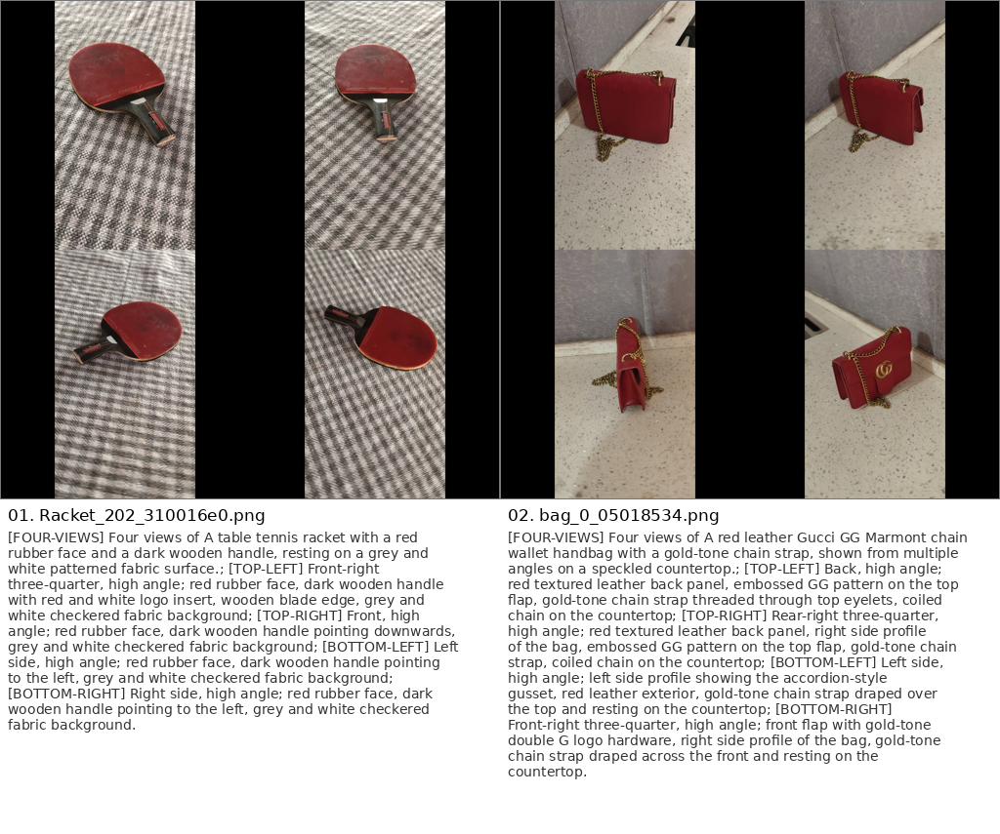
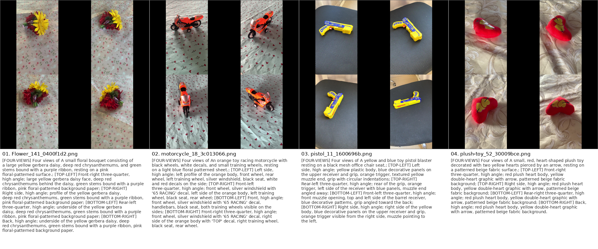

# Multi-Image Generation with In-Context LoRA

This repo aims to generate coherent 2D multi-view scenes (multiple images with intrinsic relationships, such as different viewpoints of the same object or scene) using minimal training data and limited compute. The approach builds on In-Context LoRA, a method to adapt diffusion transformer (DiT) models to multi-image outputs without changing the model architecture.

The key idea is to concatenate multiple images into one larger image during training, use a joint caption describing all sub-images, and fine-tune only lightweight LoRA adapters on a small dataset (on the order of 10–100 image sets). This enables high-fidelity multi-image generation that adheres well to the prompt, even with limited data.

## Project status

The structured preprocessing and resumable Gemini batch-captioning pipelines are
implemented. A complete Gemini 3.5 Flash run over every eligible four-view instance
under `data/` produced 423 accepted training pairs and retained 106 ambiguous
composites for abstention analysis. The minimal Study 1 pilot split, training config,
paired generation harness, and blinded scorecard are implemented, but GPU training
and evaluation have not been run. The gold benchmark, model comparison, confidence
calibration, and human review described in [PLANS.md](PLANS.md) also remain future
work.

### Latest dataset build

| Item | Result |
| --- | ---: |
| Input root | `data/` |
| Model | `gemini-3.5-flash` |
| Eligible four-view instances | 529 |
| Selected source images | 2,116 |
| Accepted image/caption pairs | 423 |
| Abstention composites | 106 |
| Invalid cached responses after repair | 0 |
| Unexpected processing failures | 0 |

Generated data is written to
`training/composites_4view_grid_all`, with ambiguous examples in
`training/composites_4view_grid_all_abstention`.

### Current structured-data examples

The following contact sheets sample accepted 2×2 composites together with their
structured captions. The first shows two examples:



The second shows four examples:



Generate another deterministic contact sheet with:

```bash
.venv/bin/python -m src.sanity_check \
  --input-dir training/composites_4view_grid_all \
  --output sanity_check.png \
  --count 4 \
  --columns 4 \
  --seed 17
```

### Research questions

- [Does LoRA improve identity without duplicating views?](PLANS.md#study-1-does-lora-improve-identity-without-duplicating-views)
- [Which Gemini model annotates viewpoints best?](PLANS.md#study-2-which-gemini-model-annotates-viewpoints-best)

### Implemented

- [x] Deterministic four-view selection and 2×2 composite construction.
- [x] Duplicate source-image detection and hashing.
- [x] Gemini model selection through `--model`.
- [x] Pydantic structured annotation schema.
- [x] Controlled viewpoint labels and explicit `indeterminate` abstention.
- [x] Raw-response caching with model, prompt, latency, and image metadata.
- [x] Deterministic caption rendering.
- [x] Separate accepted and abstention manifests.
- [x] Resumable Batch API preparation, submission, polling, and collection.
- [x] Keyed JSONL chunks with persisted job IDs and per-request result matching.
- [x] Gemini-compatible flattened structured-output schema.
- [x] Conservative normalization of impossible lateral-side combinations to
  `indeterminate`, while retaining the original raw response.
- [x] Full Gemini 3.5 Flash batch run over all 529 eligible instances in `data/`.
- [x] Existing FLUX LoRA checkpoint and local demo.
- [x] Unit tests for annotation, cache, rendering, preprocessing, and batch payloads.
- [x] Seed-17 instance-level Study 1 pilot split with leakage checks.
- [x] Minimal 500-step Study 1 LoRA config with fixed holdout monitor prompts.
- [x] Paired base-FLUX/LoRA generation manifest and blinded scoring CSV tooling.

### Next steps

- [ ] Review the 106 abstentions and spot-check the 423 accepted annotations before
  treating the generated output as training data.
- [ ] Convert `framing` to a controlled enum.
- [ ] Build and adjudicate the 100-composite gold benchmark.
- [ ] Benchmark the four selected Gemini models.
- [ ] Calibrate the low-confidence threshold.
- [ ] Add benchmark, strict-pose, and appearance-only dataset exports.
- [ ] Verify that identity captions never contain pose labels or `indeterminate`.
- [ ] Train pose-conditioned and appearance-only LoRAs with three seeds each.
- [ ] Run the Study 1 pilot training, paired generation, and blinded human scoring.
- [ ] Add DINOv2, DreamSim, LPIPS, and perceptual-hash supporting metrics.
- [ ] Run the statistical analysis and answer both research questions.

## Try the Demo on Hugging Face :hugging_face:

Here is the [Hugging Face Model Card](https://huggingface.co/rmsandu/fourviews-incontext-lora) and the [Hugging Face Demo Space](https://huggingface.co/spaces/rmsandu/fourviews-incontext-lora?).

### Historical example outputs :image:

These outputs and free-form captions predate the current structured annotation
pipeline. They are retained as historical examples and are not the final research
caption format.


```
 [FOUR-VIEWS] a red desk lamp from multiple views;[TOP-LEFT] This photo shows a 45-degree angle of desk lamp;[TOP-RIGHT] This photo shows a high-angle shot of the lamp; [BOTTOM-LEFT] Here is a side view shot of lamp; [BOTTOM-RIGHT] The back view of the desk lamp.
```


```
[FOUR-VIEWS] a bedroom from multiple views;[TOP-LEFT] This photo shows a 45-degree angle of the bedroom;[TOP-RIGHT] This photo shows a high-angle shot of the bedroom; [BOTTOM-LEFT] Here is a side view shot of bedroom; [BOTTOM-RIGHT] A low angle view of the bedroom.
```

## 1. Dataset Preparation (Multi-View Image Sets)

Collect or curate groups containing multiple views of the same object or scene.
[MVImgNet](https://github.com/GAP-LAB-CUHK-SZ/MVImgNet) is one suitable source.
The current dataset build found 529 eligible instances and deterministically selected
four spaced views from each; structured annotation accepted 423 of the resulting
composites. The original small-scale experiments used 126 selected images, while the
current Study 1 pilot uses the larger accepted dataset described above.

## 2. Automatic Caption Generation for Multi-Image Scenes

`python -m src.dataset_builder` generates captioned 2x2 composites from an
MVImgNet-style directory. Gemini credentials are loaded only when captioning starts.
Set `GOOGLE_API_KEY` in your environment or a local `.env` file:

```bash
export GOOGLE_API_KEY=your-key
python -m src.dataset_builder \
  --objects-dir data/ \
  --category-file mvimgnet_category.txt \
  --output-dir training/composites_4view_grid \
  --abstention-dir training/composites_4view_grid_abstention \
  --cache-dir .gemini_cache \
  --model gemini-3.5-flash \
  --limit 63 \
  --tile-width 512 \
  --tile-height 512
```

Gemini 3.5 Flash (`gemini-3.5-flash`) returns a JSON annotation constrained by the
`MultiviewAnnotation` Pydantic output schema rather than a free-form caption. Each
tile receives an absolute horizontal viewpoint, side, vertical angle, framing,
visible features, and confidence. Python validates the annotation and renders the
final caption deterministically.

Annotations containing an `indeterminate` viewpoint field are not written into the
LoRA training directory. Their composites and annotations
are retained in the abstention directory for evaluating whether the vision-language
model declines ambiguous orientation judgments. If `--abstention-dir` is omitted, it
defaults to a sibling named `<output-dir>_abstention`.

The cache now consists of versioned JSON envelopes. Each entry preserves the exact
raw model text, parsed annotation, validation result, model and prompt versions,
latency, composite-image hash, and hashes of the four source images. Old free-form
`.txt` cache entries are left untouched and are not reused by the structured pipeline.

For hundreds of composites, use the resumable Gemini Batch API workflow instead of
the synchronous builder. Preparation creates keyed JSONL chunks, submission records
each job before continuing, and collection downloads, validates, caches, and renders
the completed dataset:

```bash
python -m src.batch_dataset_builder prepare \
  --objects-dir data \
  --category-file data/mvimgnet_category.txt \
  --output-dir training/composites_4view_grid_all \
  --abstention-dir training/composites_4view_grid_all_abstention \
  --cache-dir .gemini_cache \
  --work-dir .gemini_batch/all_data \
  --model gemini-3.5-flash
python -m src.batch_dataset_builder submit --work-dir .gemini_batch/all_data
python -m src.batch_dataset_builder collect --work-dir .gemini_batch/all_data --wait
```

The commands are resumable. `state.json` records every submitted job ID, successful
responses are stored in the versioned cache, and rerunning `prepare` excludes valid
cached annotations while retrying invalid ones. The July 2026 run used the paths in
the example above and produced the counts reported in
[Latest dataset build](#latest-dataset-build).

For each image set, we need a single descriptive caption that encompasses all views/images. Writing these by hand is possible but to ensure scalability and consistency, we can automate caption generation using multimodal models:

The captioning pipeline defaults to Gemini 3.5 Flash (`gemini-3.5-flash`) for each
image set. Override it explicitly with `--model` when running another model.
The prompt works best when the images have already been concatenated into a single
composite image.

Example composite image:


**Example caption for a composite image:**

```
[FOUR-VIEWS] This set of four images show different angles of a light blue bag with a hexagonal pattern; [TOP-LEFT] This photo shows a side view of the bag leaning against a wall; [TOP-RIGHT] This photo shows another side view of the bag; [BOTTOM-LEFT] This photo shows a front view of the bag; [BOTTOM-RIGHT] This photo shows a back view of the bag.
```

Example (two-view caption): “[TWO-VIEWS] This set of two images presents a scene from two different viewpoints. [IMAGE1] The first image shows a living room with a sofa, side tables, a television, houseplants, wall decor, and a rug. [IMAGE2] The second image shows the same room from another angle, revealing additional details from the other side.” This consistency helps the model learn the structure of multi-image prompts. The position tokens don’t carry inherent meaning, but during training the model will learn to associate them with positioning of sub-images. The captions should read like a single narrative or list of observations rather than disconnected sentences.

## 3. Preprocessing: Composite Images and Merged Prompts

The dataset builder saves each composite image and its caption as matching `.png`
and `.txt` files. Run `python -m src.dataset_builder --help` for all options.

Example data structure: *train_data/scene01.jpg... train_data/scene01.txt.*

Turn each multi-image set into the paired training data for the model.

- **Concatenate Images**: Concatenate the images in each set into a single larger image. For example, for two images, you can place them side by side or one above the other, for four images, a 2×2 grid is convenient otherwise one long line of concatenated images might take too much memory. Ensure the composite image has a consistent size and aspect ratio across your dataset. The idea is to mimic how the model will output multiple images in one go. Arrange images in a consistent order and orientation (the order should match the order in your caption). Add minimal spacing or dividing lines if needed (but typically just concatenating directly is fine so the model sees one continuous image).

- **Composite image dimensions**: Choose dimensions that match the layout, such as
  512×1024 for two side-by-side images or 1024×1024 for a four-image grid. Keep the
  layout and caption position tags consistent, and avoid resizing source images in a
  way that distorts their aspect ratios.

## 4. Fine-tuning In-Context LoRA on the FLUX model

To train the model, we will use the In-Context LoRA approach on a diffusion transformer model like FLUX.

LoRA (Low-Rank Adaptation) inserts trainable low-rank weight matrices into the model (typically into attention layers) and freezes the original model weights. This drastically reduces the number of parameters that need updating (and thus memory usage), making it feasible to train on a single high-end GPU.

I trained a LoRA adapter on the FLUX model using the prepared multi-image dataset using the repository [AI-toolkit](https://github.com/ostris/ai-toolkit) and used as inspiration the [In-Context LoRA](https://github.com/ali-vilab/In-Context-LoRA/tree/main) config file.

The repository retains the original `config_4views.yaml` and now includes the
reproducible pilot config at `configs/study1_pilot.yaml`. Run the pilot config through
the neighboring AI Toolkit checkout using the command in
[Study 1 pilot](#study-1-pilot).

## Development and reproducibility

For CPU-only preprocessing development and tests, install the lightweight project
dependencies rather than the CUDA training stack:

```bash
python3.11 -m venv .venv
.venv/bin/python -m pip install -e ".[test]"
.venv/bin/python -m ruff check .
.venv/bin/python -m pytest
```

`requirements.txt` remains the CUDA 12.1 environment for model training. Install it
only on a compatible GPU system. To run the local Gradio demo, supply the checkpoint
path explicitly:

```bash
python app.py --lora-model models/4views.safetensors
```

To renumber an existing directory of image/caption pairs:

```bash
python -m src.rename_files training/composites_4view_grid --start 1
```

## Study 1 pilot

The minimal pilot uses a deterministic, source-instance-level 90/10 split of the
423 accepted pairs. Seed 17 produces 381 training pairs and 42 holdout pairs. The
split command verifies matching PNG/TXT stems and rejects source-instance, composite
image SHA-256, or selected source-image SHA-256 overlap across partitions:

```bash
.venv/bin/python -m src.study1_split
```

This writes `training/study1_pilot/train`, `training/study1_pilot/holdout`, and
`training/study1_pilot/split_manifest.jsonl`. The manifest records every source
instance, destination path, split parameter, composite hash, and selected source
image hashes. Re-running the command is idempotent when the existing files match;
it refuses to overwrite a different file or accept stale extra pairs.

Training uses the neighboring AI Toolkit checkout already expected by this project.
From this repository root, launch the 500-step pilot explicitly with:

```bash
python3.11 ../ai-toolkit/run.py configs/study1_pilot.yaml
```

The config trains one rank-16/alpha-16 LoRA and samples two fixed holdout captions
every 100 steps. This repository never launches that GPU command automatically.

After selecting the desired AI Toolkit checkpoint, generate the controlled base/LoRA
pairs with the eight synthetic prompts and two fixed seeds:

```bash
.venv/bin/python -m evaluation.generate_pairs \
  --lora output/study1_pilot/study1_pilot.safetensors \
  --cpu-offload
```

The generator produces 32 grids: eight prompts × seeds 1001 and 1002 × base and
LoRA. Both conditions use guidance 3.5, 20 steps, and 1024×1024 resolution. It
recreates the CPU-backed torch generator immediately before every condition, leaves
the LoRA unfused, and writes all settings, hashes, and output paths to
`evaluation/outputs/study1_pilot/generation_manifest.jsonl`.

Create randomized A/B image copies, a blank scoring CSV, and a separate condition
key with:

```bash
.venv/bin/python -m evaluation.create_blinded_scorecard \
  --generation-manifest evaluation/outputs/study1_pilot/generation_manifest.jsonl \
  --output-dir evaluation/outputs/study1_pilot_blinded \
  --blind-seed 17
```

Give raters `scorecard.csv` and the adjacent `images/` directory, but withhold
`blind_key.jsonl` until scoring is complete. Run the focused CPU checks with:

```bash
.venv/bin/python -m pytest tests/test_study1_split.py tests/test_evaluation_pairing.py
```
